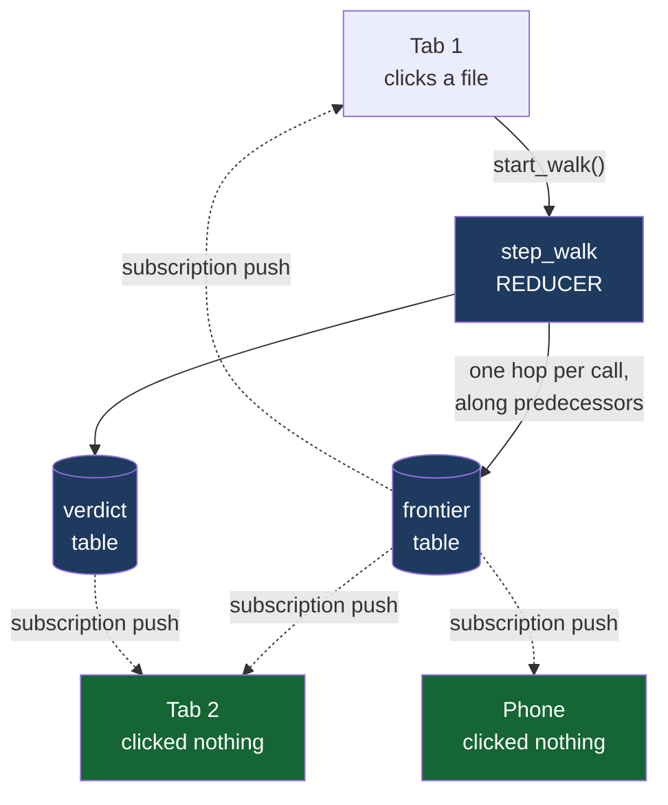

# The Map Room

**For engineers running AI coding agents — paste your repo and watch, with your team,
the map your agent is actually using, and the roads it can't see.**

Built at Midnight Moonshot (SpacetimeDB World Tour, Bengaluru, Sep 5–6 2026).

## The problem

When an AI agent works on your repo, it doesn't read everything. It decides what to
look at and what to skip using a **map of your code** — a call graph. Almost nobody
checks whether that map is any good.

The published measurement is not encouraging. Across 172 real, human-verified bug
fixes in 7 repositories, a name-matched call graph — the kind Aider's repo map,
RepoGraph and LocAgent actually build — reaches the test that guards the fix
**31.4%** of the time. Type-resolved, it reaches **41.9%**. On matplotlib and pytest
it reaches **zero**: those guarding tests aren't merely far away, they sit in a
different component of the graph entirely.

## What this is

The Map Room makes that watchable, and makes it multiplayer.

Open a room. Everyone with the link is inside it. Click a changed file, and a
bounded 6-hop **backwards** walk runs inside the database as a reducer, writing each
hop into a `frontier` table. The walk paints — hop by hop — on every screen at once.
When it exhausts without reaching the test that guards the fix, that test lights up
red for everyone, and the verdict lands: `RUN_FULL`.

Live shared state is not decoration here. The walk is a thing several people watch
happen to the same graph at the same time, and the fan-out is the product.



**Tab 2 called nothing and sees the identical animation.** Verified in two real
browser tabs — same paint, same verdict, no refresh, no console errors.

## Honesty about the number

Recall is **not** computable on an unlabelled repository — it needs a known guarding
test to check against. Where this product shows a verdict on code with no labels, it
says so, and cites the measured prior rather than inventing a number. The bar for
`SKIP_SAFE` is the one-sided 95% Wilson lower bound, never the point estimate, so no
small sample can license a skip.

## Stack

SpacetimeDB module on Maincloud (tables + reducers, TypeScript) · React 19 + Vite +
Tailwind client on the SpacetimeDB TS SDK · a Python loader for the seeded graphs.

Measurement corpus: SWE-bench Verified instances (public dataset).

## Documentation

| Doc | What's in it |
|---|---|
| [`docs/PROBLEM-STATEMENT.md`](docs/PROBLEM-STATEMENT.md) | The problem, the evidence, and the diagrams — the backwards walk, the per-repo spread, why a better extractor doesn't fix it |
| [`docs/SOLUTION.md`](docs/SOLUTION.md) | What we built and why it takes this shape |
| [`docs/SPACETIMEDB.md`](docs/SPACETIMEDB.md) | **Where and how SpacetimeDB is used** — and what we didn't have to build because of it |
| [`docs/PRD-PRODUCT.md`](docs/PRD-PRODUCT.md) | Product PRD — plain language. Features, users, journeys |
| [`docs/PRD-TECHNICAL.md`](docs/PRD-TECHNICAL.md) | Technical PRD — schema, reducers, the walk, constraints |
| [`docs/PROCESS.md`](docs/PROCESS.md) | Decisions, and the things that broke |
| [`CONTRACT.md`](CONTRACT.md) | The module schema contract |

## Run it

```bash
# module
cd module && npm install && spacetime publish map-room

# load a graph
python -m ingest.seed --instance django__django-11292 --module map-room --limit 6

# client
cd client && npm install && npm run dev
```

## Status

Module live on Maincloud as `map-room`. Loader verified end to end.

The demo walk is measured, not asserted. From a labelled fix site in
`django__django-11292`, six hops allowed:

```
hop 0  █                                                     1 node
hop 1  ███████                                              58 nodes
hop 2  ████████████████████████████████████████████████    389 nodes
hop 3  ███████                                              57 nodes
hop 4  █▌                                                   11 nodes
       ──────────────────────────────────────────────────
       frontier exhausted · 416 nodes reached

       graph_complete = true      ← ran out of GRAPH, not out of hops
       verdict        = RUN_FULL
       wilson_lb      = 0.3585     threshold 0.95
       missed         = DateTimeFieldTest#test_datetimefield_1()
```

The walk finished cleanly and still never reached the test that guards that fix.
