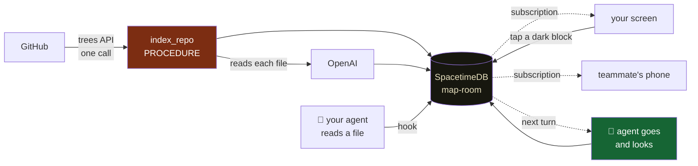

# The Map Room

**Watch your AI agent explore your codebase, live — and when you see a place it
never looked, tap it, and the agent goes and looks.**

### → [map-room-beta.vercel.app](https://map-room-beta.vercel.app)

Built at Midnight Moonshot, the SpacetimeDB World Tour hackathon in Bengaluru.

---

## Try it in three steps

**1. Watch a map that is already live**

[map-room-beta.vercel.app/?repo=Piyush-sahoo/spacetime-hacks](https://map-room-beta.vercel.app/?repo=Piyush-sahoo/spacetime-hacks)

No signup. Every block is a file. Dashed means nobody has ever opened it.

**2. Put your own repository on the map**

Paste a GitHub URL on the front page. About three seconds later you have a map,
and a few seconds after that every file and directory on it explains itself.
Nothing to install and no API key of your own.

**3. Put your agent on it**

Open your project page and press **Copy setup instruction**, then paste that into
Claude Code, Codex, Cursor or opencode. The agent installs the integration itself.

From then on, everything it reads, edits or searches lights up on your map — and
on any screen watching it, at the same moment.

---

## The problem

When an AI agent works on your repo it doesn't read everything. It decides what
to look at using a **map of your code** — a call graph — and almost nobody checks
whether that map is any good.

The published measurement is not encouraging. Across **172 human-verified bug
fixes in 7 repositories**, a name-matched call graph — the kind Aider's repo map,
RepoGraph and LocAgent actually build — reaches the test that guards the fix
**31.4%** of the time. Type-resolved, **41.9%**. On matplotlib and pytest, zero.

And that is the optimistic half. An agent's context is finite, so a repo map
keeps only the top-K symbols:

```
how much of the map the agent holds  →  how often it finds the test that catches the bug

full map    ████████████████████████████████████████  55%
top 400     ██▌                                        5%
top 200                                                0%
top 100                                                0%
```

**The dark region is not an edge case. It is most of your codebase, every run.**

When an agent says "done", you get its output. You do not get its *attention* —
which files it opened, which it never touched, which region it quietly decided
was irrelevant. You cannot correct a blind spot you cannot see.

---

## How it works



Read it as a circle: **agent → map → human → map → agent.** The database sits in
the middle of every arrow.

### 1. A URL becomes a map — no backend, no clone

```
paste github.com/owner/repo
   ↓
procedure index_repo(owner, repo, token)
   ctx.http.fetch("api.github.com/repos/{o}/{r}/git/trees/HEAD?recursive=1")
   ↓  one call returns EVERY file path in the repo
   ctx.withTx(tx => insert one node per source file)
   ↓  then, still inside the procedure:
   read each file · extract imports by regex · ask a model what it does
   ↓
a map where every block has a height, a colour and a sentence
```

| repo | files | time |
|---|---:|---:|
| `django/django` | 2,975 | 3.6 s |
| `pallets/werkzeug` | 139 | 1.4 s |
| `chalk/chalk` | 14 | 77 s *(including explanations)* |

Indexing is dominated by one GitHub round trip, not repo size. It works
**unauthenticated**, so anyone can paste a URL.

**Import edges come from a regular expression, never from a model.** An import
the parser cannot resolve is dropped and counted, never guessed — a hallucinated
edge would corrupt the exact relation this product measures. The model is only
asked for a sentence, which cannot corrupt a graph.

### 2. Your agent's attention becomes visible

A hook fires after every file operation and reports the paths:

```
report_touch(repo_id, session, agent_name, tool, paths_json)
   ↓  resolves each path to every node in that file
node_cov rows → subscription → every screen lights up
```

Median **6 ms** from the database accepting a call to it being painted on every
connected screen.

`Bash` is matched as well as `Read`/`Edit`/`Write`/`Grep`/`Glob`, which matters
more than it looks: before that, a session whose subagents explored with `cat`
and `grep` recorded **8 touches**.

**`git diff` cannot do this.** It shows what *changed*. This is about what was
*looked at*, and above all what was never opened. A file the agent read and
dismissed leaves no trace in git; one it never opened leaves no trace anywhere.

### 3. A human steers the agent


An agent cannot hold a subscription — it works in turns. So human → agent is a
**pull at turn boundaries**: when you type, when the agent finishes a turn, or
when its session ends. Agent → human is a **true push**.

---

## Reading the map

| | meaning |
|---|---|
| **dashed, hollow** | never opened — this is the finding |
| 🟢 **green** | read in the last five minutes — still in the agent's context |
| 🟠 **orange** | the agent **changed** this file |
| 🔴 **red** | read more than fifteen minutes ago — out of context |
| 🔵 **blue** | created after the map was cut — new ground |

The clock is the **agent's context**, not wall time. A file read five minutes ago
is probably still in its window; one read fifteen minutes and a few hundred tool
calls ago is a summary at best.

**Click a block** — what the file does, and its blast radius: what it imports and
what imports it, everything else dimmed.
**Click a district plate** — what that directory does, and every file inside it.
**Click a dashed block** — it goes on the queue for an agent.

Two links per repository:

| link | shows |
|---|---|
| `?repo=owner/repo` | everything every agent has ever explored |
| `?repo=owner/repo&session=<id>` | one run's route, on its own |

The plugin prints your session's link into your terminal. Open both side by side
to compare one run against the whole history.

---

## Where SpacetimeDB is used

**There is no backend.** Not a thin one — none. The database fetches your
repository, indexes it, calls the model, serves every client, tracks who is in
the room and runs the graph traversal.

| feature | used for |
|---|---|
| tables as primary state | the graph, coverage, routes, presence, requests, explanations |
| reducers | path resolution, the walk, session lifecycle, the request queue |
| **procedures + `ctx.http.fetch`** | **fetching GitHub and calling the model — with no server anywhere** |
| `ctx.withTx` | committing a batch of writes from inside a procedure |
| subscriptions | the entire UI. No polling, anywhere |
| `identity_connected` / `identity_disconnected` | presence, free |
| btree indexes | `edge.dst` for the walk, `frontier.walk_id` for the paint |
| private tables | the API key store, and the path-resolution cache |
| HTTP `call/` + `/sql` | the agent plugins and the bulk loader |

**20 tables · 17 reducers · 4 procedures.**

What we did not have to build: a REST API, a WebSocket server, a pub/sub layer,
a presence service, a job queue, a cache and its invalidation, a secrets service,
or any deployed server process. The client is a static bundle; the plugins are
small scripts.

The single decision this rests on: **a procedure can make outbound HTTP calls and
then write transactionally.** That is why "paste a URL and the database goes and
gets your repo" is one function rather than a service.

---

## Agent support

| agent | how it reports | mechanism |
|---|---|---|
| **Claude Code** | enforced | `PostToolUse` hook |
| **Codex** | enforced | `PostToolUse` in `.codex/hooks.json` |
| **Cursor** | enforced | `beforeReadFile`, `afterFileEdit`, `afterShellExecution` |
| **opencode** | enforced | plugin `tool.execute.after` |
| anything else | cooperative | the agent calls the report command itself |

**Enforced** means the tool runs the hook — the agent cannot forget. Answering a
human's click is cooperative everywhere, because no hook can read a file for you.

One manual step exists and cannot be automated: **Codex requires you to trust the
hook** with `/hooks` inside Codex. That is a security feature, not a gap.

Install: press **Copy setup instruction** on any project page and paste it into
your agent. Details in [`plugin/agents/README.md`](plugin/agents/README.md).

---

## Measured

Every number here was observed, not asserted.

```
6 ms          median from server ack to painted on every connected screen
0.000000px    block movement across a coverage change
823 ms        first colour after a touch, from a fully neutral map
0.25%         idle CPU (63% before the render loop learned to park)
1.41 ms       average paint, 70-block map · 5.9 ms on django/django (2,975 files)
```

**Layout is a pure function of the graph.** Coverage changes colour and nothing
else, so the eye tracks light spreading across stable ground rather than a map
rearranging underneath it.

**Live right now:** 16 repositories · 947 files explained · 193 directories
explained · 1,948 real import edges.

---

## Honesty about the number

Recall is **not computable on an unlabelled repository** — it needs a known
guarding test to check against. Where this product would show a verdict on code
with no labels, it says so and cites the measured prior rather than inventing a
number.

The bar for allowing a skip is the **one-sided 95% Wilson lower bound**, never
the point estimate:

```
wilsonLb(72, 172) = 0.3585        threshold = 0.95        → RUN_FULL
```

A perfect 3/3 scores 0.526 and still cannot license a skip.

---

## Run it yourself

```bash
git clone https://github.com/Piyush-sahoo/spacetime-hacks
cd spacetime-hacks

# the module
cd module && npm install
spacetime publish map-room          # never with -c: that wipes the graphs

# explanations (optional — everything else works without it)
spacetime call map-room set_secret openai "<your key>"

# the client
cd ../client && npm install && npm run dev
```

```
module/    SpacetimeDB module, TypeScript — 20 tables, 17 reducers, 4 procedures
client/    React 19 + Vite on the SpacetimeDB TS SDK. A static bundle
plugin/    agent integrations — hooks, a skill, and a CLI. Python stdlib only
ingest/    Python loader for the seeded SWE-bench corpus
docs/      architecture, problem statement, PRDs, and what broke on the way
```

---

## Known limits

- **The module has no authorization.** Any caller can invoke any reducer,
  including `reset_coverage`. Fine for a hackathon and a shared demo; it is the
  first thing to fix before this is used for real.
- **The `touch` table is public**, so file paths reported by any agent are
  readable by anyone with the database name. Do not point it at a private repo
  you care about.
- **Explanations are capped** at roughly 150 seconds of work per index. A large
  repository gets a partial pass; the rest is available from the *deepen this map*
  control on its project page.
- **The seeded django corpus is not enriched** — 2,975 files was out of scope.
  Those maps work; their blocks simply have no sentences.

---

## Documentation

| doc | what's in it |
|---|---|
| [`docs/ARCHITECTURE.md`](docs/ARCHITECTURE.md) | the whole system and what we didn't have to build |
| [`docs/PROBLEM-STATEMENT.md`](docs/PROBLEM-STATEMENT.md) | the measurement, and why a better extractor doesn't fix it |
| [`docs/AGENT-LOOP.md`](docs/AGENT-LOOP.md) | how the agent publishes its attention and how your tap reaches it |
| [`docs/SPACETIMEDB.md`](docs/SPACETIMEDB.md) | where and how the database is used |
| [`docs/PRD-PRODUCT.md`](docs/PRD-PRODUCT.md) | product PRD, plain language |
| [`docs/PRD-TECHNICAL.md`](docs/PRD-TECHNICAL.md) | schema, reducers, constraints |
| [`docs/PROCESS.md`](docs/PROCESS.md) | decisions, and the things that broke |

Measurement corpus: SWE-bench Verified (public dataset).
