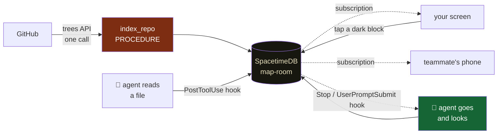
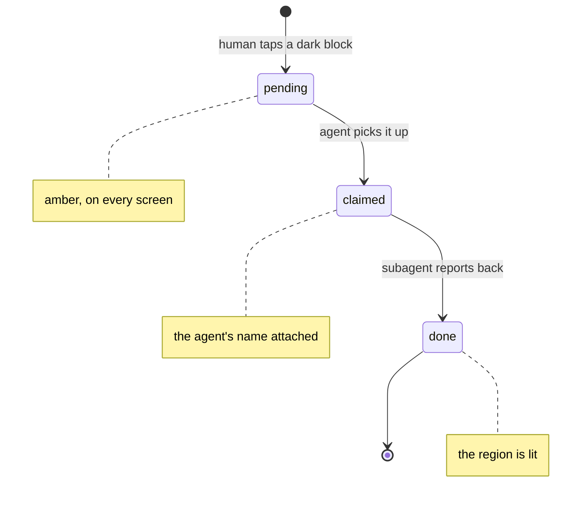

# The Map Room

**Watch your AI agent explore your codebase, live — and when you see a place it never
looked, tap it, and the agent goes and looks.**

**Live:** https://map-room-piyushs-projects-4db92eb5.vercel.app

Built at Midnight Moonshot (SpacetimeDB World Tour, Bengaluru).

---

## The problem

When an AI agent works on your repo it doesn't read everything. It decides what to
look at using a **map of your code** — a call graph — and almost nobody checks whether
that map is any good.

The published measurement is not encouraging. Across **172 human-verified bug fixes in
7 repositories**, a name-matched call graph — the kind Aider's repo map, RepoGraph and
LocAgent actually build — reaches the test that guards the fix **31.4%** of the time.
Type-resolved, **41.9%**. On matplotlib and pytest, **zero**.

And that is the *optimistic* half. An agent's context is finite, so a repo map keeps
only the top-K symbols:

```
how much of the map the agent holds  →  how often it finds the test that catches the bug

full map    ████████████████████████████████████████  55%
top 400     ██▌                                        5%
top 200                                                0%
top 100                                                0%
top  50                                                0%
```

**The dark region is not an edge case. It is most of your codebase, on every run.**

When an agent says "done", you get its output. You do not get its *attention* — which
files it opened, which it never touched, which region it silently decided was
irrelevant. You cannot correct a blind spot you cannot see.

---

## How it works, end to end



Read it as a circle: **agent → map → human → map → agent.** The database sits in the
middle of every arrow.

### 1. A repo becomes a map — no backend, no clone

```
paste github.com/owner/repo
   ↓
procedure index_repo(owner, repo, token)
   ctx.http.fetch("api.github.com/repos/{o}/{r}/git/trees/HEAD?recursive=1")
   ↓  one call returns EVERY file path in the repo
   ctx.withTx(tx => insert one node per source file)
   ↓
the map exists — every block dark, because nobody has looked yet
```

**Measured, live:**

| repo | blobs | source files | time |
|---|---:|---:|---:|
| `django/django` | 7,087 | 2,975 | 3.6 s |
| `pallets/werkzeug` | — | 139 | 1.4 s |
| `pallets/click` | — | 79 | 2.2 s |
| `Piyush-sahoo/spacetime-hacks` | 214 | 70 | 3.5 s |

Time is dominated by the GitHub round trip, not repo size. It works **unauthenticated**,
so an anonymous visitor can paste a URL and get a map. **13 repositories are indexed
right now.**

### 2. The agent's attention becomes visible

A `PostToolUse` hook fires after every `Read`, `Edit`, `Write`, `Grep`, `Glob` **and
`Bash`**, and reports the touched paths:

```
report_touch(repo_id, session, agent_name, tool, paths_json)
   ↓  resolves each path to every node in that file
node_cov rows → subscription → every screen lights up
```

`Bash` matters more than it looks: an agent that explores with `cat` and `grep` is
invisible without it. Measured before that fix — a session whose subagents read
hundreds of files recorded **8 touches**.

**`git diff` cannot do this.** It shows what *changed*. This is about what was *looked
at*, and above all what was never opened. A file the agent read and dismissed leaves no
trace in git; a file it never opened leaves no trace anywhere.

### 3. A human steers the agent



An agent can't hold a subscription — it works in turns. So the human → agent hop is a
**pull at turn boundaries**, over three hooks:

| hook | fires when | covers |
|---|---|---|
| `UserPromptSubmit` | you type anything | the agent is idle and you speak to it |
| `Stop` | the agent finishes a turn | **it was working, then went quiet** |
| `SessionEnd` / `SubagentStop` | the run ends | switching a finished agent's colour off |

The agent → human direction is a **true push**.

---

## The view

An isometric survey of your repository. Directories are districts on dashed plates;
files are extruded blocks. **Dashed and hollow = never opened.** Filled = the agent has
been there, in that agent's colour — the main agent in ember, each subagent in its own
hue, so several agents exploring at once are legible at a glance.

The agent's **route** is drawn on the ground plane in the order it actually read things,
one right-angle bend per hop, with a packet riding it. The packet *is* the agent.
`TRACE ONE STEP` walks the session one real tool call at a time.

| region | content |
|---|---|
| top strip | repo · session · explored n/N · agents · asked/live/done · feed state — all ticking live |
| left index | directories with lit/dark counts; click to fly the camera; drill into one |
| canvas | the isometric city, the route, the packet, the timeline |
| right panel | **ACTIVITY** (live tool-call feed) · WHAT IT DOES · ASKED · IMPACT WALK |

Two links per repo:

| link | shows |
|---|---|
| `?repo=owner/repo` | everything every agent has ever explored |
| `?repo=owner/repo&session=<uuid>` | one session's route, on its own |

The plugin prints the session link into your terminal when a session starts. Open both
side by side to compare one run against the whole history.

---

## Install

Nothing to clone — the repository is public, so Claude Code fetches it itself.

```bash
spacetime login
claude plugin marketplace add Piyush-sahoo/spacetime-hacks
claude plugin install map-room@map-room
```

Then restart Claude Code (hooks load at session start) and confirm:

```bash
claude plugin details map-room@map-room     # expect Skills (1), Hooks (5)
```

**Nothing needs pasting.** The plugin reads `git remote get-url origin`, derives
`owner/repo`, and matches it to the indexed slug automatically. If your repo isn't
indexed yet, index it from the front page — three and a half seconds.

If a repo is not indexed, the plugin **reports nothing, on purpose.** There is no
default fallback, because a default would mean every unconfigured install polluting
someone else's map.

Full walkthrough with expected output and failure modes: the project page in the app.

> **Know what you are installing.** The plugin installs at *user* scope, so its hook
> fires in every project you open and reports those file paths into a table anyone can
> read. `claude plugin disable map-room@map-room` turns it off.

---

## Where SpacetimeDB is used

**There is no backend.** Not a thin one — none. The database fetches your repository,
indexes it, serves every client, runs the graph traversal, tracks who is in the room,
and calls the AI.

| feature | used for |
|---|---|
| tables as primary state | the graph, coverage, routes, walks, verdicts, presence, requests |
| reducers | path resolution, the bounded walk, the verdict, session lifecycle |
| **procedures + `ctx.http.fetch`** | **fetching and indexing a GitHub repo, and calling Gemini — with no server anywhere** |
| subscriptions | the entire UI. No polling, anywhere |
| `identity_connected` / `identity_disconnected` | presence, free |
| btree indexes | `edge.dst` for the walk, `frontier.walk_id` for the paint |
| HTTP `call/` + `/sql` | the plugin and the bulk loader |

**17 tables · 16 reducers · 2 procedures.** What we did not have to build: a REST API,
a WebSocket server, a pub/sub layer, a presence service, a job queue, a cache and its
invalidation, or any deployed server process. The client is a static bundle; the plugin
is seven Python scripts.

---

## Measured

Every number below was observed, not asserted.

**Real-time propagation** — 10 touches ~300ms apart, two independent browser tabs:

```
end-to-end        min 632   median 644   max 675 ms    ← the plugin's HTTP call to Maincloud
after server ack  min   2   median   6   max  13 ms    ← the subscription push to every screen

10/10 arrived in both tabs, identical order
performance.getEntriesByType('navigation').length === 1   ← provably no reload
```

**Layout stability** — a block's screen position across a coverage change:

```
sx 201.942857 → 201.942857     dx = 0.000000px
sy 416.859524 → 416.859524     dy = 0.000000px
```

Geometry is a pure function of `node` + `edge`. Coverage changes colour and nothing
else, so the eye tracks light spreading across stable ground.

**Colour truth** — on a repo with 14 historically-lit blocks and nobody connected:
hue fills `[]`, legend reads *"No agent connected"*, every swatch neutral. One touch →
first hue at **823 ms**.

**Other:** paint 2.2–4.4 ms average on the demo repo, 5.9 ms on django/django (2,975
files, 695 districts) · idle CPU parks at **0.25%**, 0 rAF ticks over 3 s · per-tool-call
duration captured, 17–23 ms · `scrollWidth === clientWidth` at 390 px.

---

## Honesty about the number

Recall is **not computable on an unlabelled repository** — it needs a known guarding
test to check against. Where this product shows a verdict on code with no labels, it
says so and cites the measured prior rather than inventing a number.

The bar for `SKIP_SAFE` is the **one-sided 95% Wilson lower bound**, never the point
estimate, so no small sample can license a skip:

```
wilsonLb(72, 172) = 0.3585        threshold = 0.95        → RUN_FULL
```

A perfect 3/3 scores 0.526 and still cannot license a skip. The `SKIP_SAFE` path is
implemented and reachable. No graph class has earned it.

---

## Documentation

| doc | what's in it |
|---|---|
| [`docs/ARCHITECTURE.md`](docs/ARCHITECTURE.md) | the whole system, the three flows, what we didn't have to build |
| [`docs/PROBLEM-STATEMENT.md`](docs/PROBLEM-STATEMENT.md) | the measurement, the diagrams, why a better extractor doesn't fix it |
| [`docs/SOLUTION.md`](docs/SOLUTION.md) | what we built and why it takes this shape |
| [`docs/AGENT-LOOP.md`](docs/AGENT-LOOP.md) | how the agent publishes its attention, how your tap reaches it |
| [`docs/SPACETIMEDB.md`](docs/SPACETIMEDB.md) | where and how the database is used |
| [`docs/PRD-PRODUCT.md`](docs/PRD-PRODUCT.md) | product PRD — plain language, no schemas |
| [`docs/PRD-TECHNICAL.md`](docs/PRD-TECHNICAL.md) | schema, reducers, the walk, constraints |
| [`docs/PROCESS.md`](docs/PROCESS.md) | decisions, and the things that broke |
| [`CONTRACT.md`](CONTRACT.md) · [`CONTRACT-V2.md`](CONTRACT-V2.md) | the module contract and verified API facts |

---

## Repository

```
module/    SpacetimeDB module — TypeScript. 17 tables, 16 reducers, 2 procedures
client/    React 19 + Vite, on the SpacetimeDB TS SDK. Static bundle
plugin/    Claude Code plugin — 5 hooks, a skill, and a CLI. Python stdlib only
ingest/    Python loader for the seeded SWE-bench corpus
data/       SWE-bench Verified graphs (public dataset)
docs/       the documentation set above
```

Run it:

```bash
cd module && npm install && spacetime publish map-room   # never with -c: that wipes the graphs
cd client && npm install && npm run dev
```

Measurement corpus: SWE-bench Verified (public dataset).
