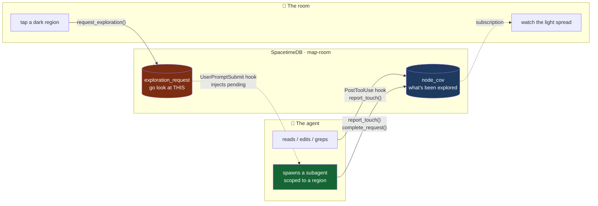
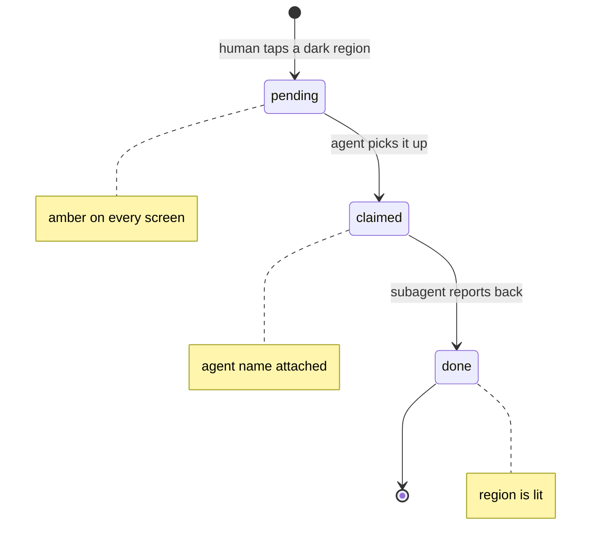

# The agent loop

The core of the product: an AI agent publishes what it explores, a human sees what
it didn't, and points — and the agent goes and looks.

---

## The loop



Read it as a circle: **agent → map → human → map → agent.** The database sits in the
middle of every arrow.

---

## Why the agent is a participant, not a subject

Most agent observability is a log you read afterwards. This is different in one
specific way: **the agent and the human are two clients of the same tables.**

The agent doesn't send you a report. It writes rows. Your screen is subscribed to
those rows, so it updates itself. Your tap isn't an API call to a service — it's
another row, in a table the agent is also reading.

Neither side knows about the other. They only know about the database.

---

## How the agent publishes

A `PostToolUse` hook fires after every `Read`, `Edit`, `Write`, `Grep` and `Glob`.
It takes the file paths out of the tool input and calls one reducer:

```
report_touch(repo_id, session, agent_name, tool, paths_json)
```

The reducer resolves each path to graph nodes and marks them explored. The rule:

```
django/forms/fields.py
  → strip the extension        django/forms/fields
  → slashes become dots        django.forms.fields
  → match every node whose qual ends with that
```

A file touch lights **the whole file**, not one symbol. When a path resolves to
nothing, the touch is still recorded with `node_id = 0`, so misses are countable
rather than silently dropped.

The hook is **fire-and-forget** — two-second timeout, errors swallowed. Instrumentation
that can break someone's coding session is not instrumentation anyone will install.

## How your tap reaches the agent

Clicking a dark region calls:

```
request_exploration(repo_id, node_id, note)
```

That row appears immediately for everyone in the room. On the agent's side, a
`UserPromptSubmit` hook checks for pending requests and injects them into context:

> The human has asked you to explore these regions: `django/forms/fields.py`

The agent then claims it, spawns a subagent scoped to that path, explores — which
fires the coverage hook again, lighting that region — and completes the request.



---

## The one honest limitation

**An agent cannot subscribe.** It is turn-based — it does not hold a socket open and
react to a push mid-thought.

So the human → agent hop is a **pull at turn boundaries**, not a push. In practice
you tap while the agent is mid-task and it picks the request up within seconds, which
reads as instant. But it is a pull, and the demo says so.

The agent → human direction *is* a true push. Coverage lands on every screen the
moment the reducer commits.

---

## Precedent: an agent consuming a measured signal

This pattern has been demonstrated end to end over MCP — an agent asking an external,
measured gate before trusting its own graph-selected subset, and **abstaining** when
the gate refuses:

```
[agent]  task: 'change src touching the ORM; run affected tests'
[agent]  policy: ask the gate before trusting any graph-selected subset
[gate]   decision=RUN_FULL recall=0.5455 n=44 bar=0.95
[agent]  ABSTAIN from subset selection → running the FULL suite
[gate]   evidence: graph_complete=True, selected 0 of 370 guarding tests
```

The decision rule there was scripted, not an LLM — but the transport, the server,
the measured verdict and the behavioural branch were all real. The point it
establishes: **once an external signal exists, an agent consuming it is trivial.**
Two lines of policy.

This product is the other half of that. The signal stops being a verdict the agent
asks for, and becomes a shared map the human can write to.

---

## Why this needs live shared state

Strip the database out and ask what remains.

The agent could log to a file. You could read the file. You could send it a message.
All of that exists and none of it is this product, because the value is in the
simultaneity: **light spreading across a map while several people watch it, and a tap
that everyone sees land.**

| | |
|---|---|
| The agent's attention | a table, pushed to every screen as it changes |
| Your correction | a row the agent reads on its next turn |
| Who else is watching | native presence, no heartbeat code |
| The graph itself | tables, indexed, queried in-process by the walk reducer |

No backend. No API. No polling. No socket plumbing. The parts that would normally
be a service are reducers, and the part that would be a fan-out layer is a
subscription.

---

## Tables

```
node_cov      node_id · repo_id · touches · last_tool · last_session
              · explored · last_at
touch         id · repo_id · node_id · path · tool · session
              · agent_name · at
agent_session id · session · agent_name · repo_id · online · touches
              · started_at · last_at
exploration_request
              id · repo_id · node_id · path · note · status
              · asked_by · claimed_by · result · at
```

`status` is `pending` → `claimed` → `done`. Full schema in
[`PRD-TECHNICAL.md`](PRD-TECHNICAL.md); the contract is `CONTRACT-V2.md`.
