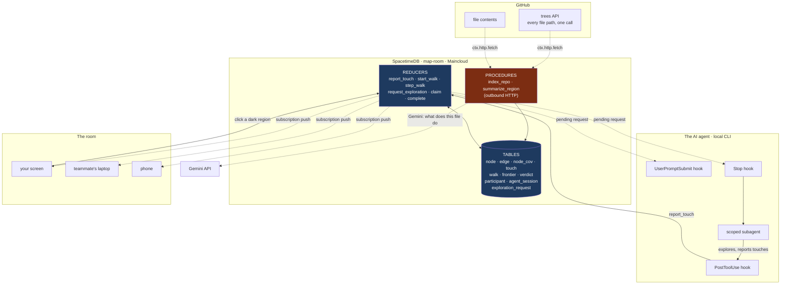

# Architecture

**There is no backend.**

Not "a thin backend". Not "serverless functions". The database fetches your repository,
indexes it, serves every client, runs the graph traversal, tracks who is in the room,
and calls the AI. Every line of server logic is a reducer or a procedure inside
SpacetimeDB.

---

## The whole system



---

## Three flows

### 1. Terrain — a repo becomes a map

```
paste github.com/owner/repo
   ↓
procedure index_repo(owner, repo, token)
   ctx.http.fetch("api.github.com/repos/{o}/{r}/git/trees/HEAD?recursive=1")
   ↓  one call returns EVERY file path in the repo
   ctx.withTx(tx => insert one node per source file)
   ↓
the map exists — dark, but real
```

No clone. No tarball. No parser. One HTTP request from inside the database, and a
repository of any language is on the map in seconds. `truncated: true` on very large
repos is recorded on the repo row and surfaced, never silently ignored.

### 2. Light — the agent's attention becomes visible

```
agent Reads / Edits / Greps a file
   ↓  PostToolUse hook (fire-and-forget, ~99ms, errors swallowed)
report_touch(repo_id, session, agent_name, tool, paths_json)
   ↓  resolves the path to EVERY node in that file
node_cov rows → subscription → every screen lights up
```

The hook is the only thing that can see this. **`git diff` cannot** — it shows what
*changed*, and the product is about what was *looked at*, and above all what was never
opened at all. A file the agent read and dismissed leaves no trace in git. A file it
never opened leaves no trace anywhere.

### 3. Correction — a human steers the agent

```
you tap a dark region
   ↓
request_exploration(repo_id, node_id, note)     → pending, amber on every screen
   ↓
the agent finds out (three paths, below)
   ↓
claim_request                                    → claimed, cyan, "EXPLORING"
   ↓
subagent explores → fires the coverage hook      → the region lights up
   ↓
complete_request(result)                         → done, green, "REPORTED"
```

---

## How a click reaches a turn-based agent

An AI agent cannot hold a subscription — it works in turns. So the human → agent
direction is a **pull at turn boundaries**, three ways:

| Path | Fires when | Covers |
|---|---|---|
| `UserPromptSubmit` | you type anything | the agent is idle and you speak to it |
| `Stop` | the agent finishes a turn | **the agent is working, then goes quiet** |
| subscriber daemon | instantly, on insert | nobody is at the keyboard at all |

The `Stop` hook is the important one: without it, a request made while the agent is
mid-task is never seen, because the agent finishes and falls silent.

The agent → human direction is a **true push**. Coverage lands on every screen the
moment the reducer commits.

---

## What Gemini is and is not used for

| | |
|---|---|
| **Used for** | one-sentence summaries of a dark region — *"handles password reset token validation"* — so unexplored territory has meaning, not just a filename |
| **Never used for** | extracting the call graph |

Parsing is deterministic and must stay that way. A hallucinated call edge would corrupt
the exact thing this product measures. The API key is passed as a procedure argument
and is never written to a file or committed.

---

## The leaderboard

Ranked by **human saves** — completed exploration requests. How many times someone
pointed at a dark region and the agent found something there.

Deliberately *not* ranked by coverage percentage. A coverage leaderboard rewards an
agent that reads everything, which wastes context and contradicts the measurement this
product is built on: at 400 kept identifiers a repo map reaches 2/44 guarding tests,
so *more reading* is not the fix. It is also incomparable across repo sizes — 80% of a
20-file project is not 80% of django.

Human saves is a real count, comparable across any repo, and climbing it requires using
the loop.

---

## What we did not have to build

| Normally | Here |
|---|---|
| REST API in front of the graph | reducers |
| WebSocket server + reconnect logic | subscriptions |
| Pub/sub fan-out (Redis, Kafka) | subscriptions |
| Presence service with heartbeats | `identity_connected` / `identity_disconnected` |
| A job runner for the graph walk | `step_walk`, one hop per call |
| A backend to fetch and index repos | procedures with `ctx.http.fetch` |
| A cache and its invalidation | the tables are the state |
| Any deployed server process | none |

The client is a static bundle. The plugin is four Python scripts. Everything else is
the database.

---

## Verified constraints

| Constraint | Consequence |
|---|---|
| Procedures cannot hold a transaction while fetching | fetch first, then `ctx.withTx` |
| `ctx.http.fetch` default 30s timeout, max 180s | large repos need the tree API, not a clone |
| `node.id` is a **global** primary key, not per-repo | every indexed repo needs its own id band, or nodes collide and vanish |
| SpacetimeDB SQL has no `GROUP BY`, aggregates need aliases | roll up client-side from subscribed rows |
| Browsers cannot set `Authorization` on a WebSocket | public tables, or a token via query param |
| u64 reducer args must be JSON **numbers**, not strings | `["1", …]` → `400 invalid type` |
| GitHub unauthenticated is 60 req/hr | fine for a room; a PAT raises it to 5,000 |

---

## The integration seam most likely to break

The indexer writes `node.qual`; `report_touch` resolves a touched file path by dotting
it and matching nodes whose `qual` ends with that dotted path:

```
src/lib/auth.ts   →  strip extension  →  src/lib/auth
                  →  slashes to dots  →  src.lib.auth
                  →  match nodes whose qual ends with it
```

If the indexer and the resolver disagree by so much as a leading `./`, **every touch
resolves to `node_id = 0`, the map stays dark, and every component reports success.**
Unresolved touches are therefore still written with `node_id = 0` so the miss is
countable and visible rather than silent.
