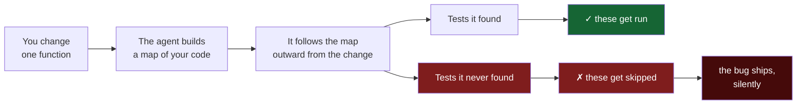
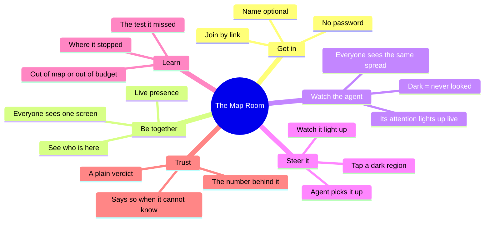
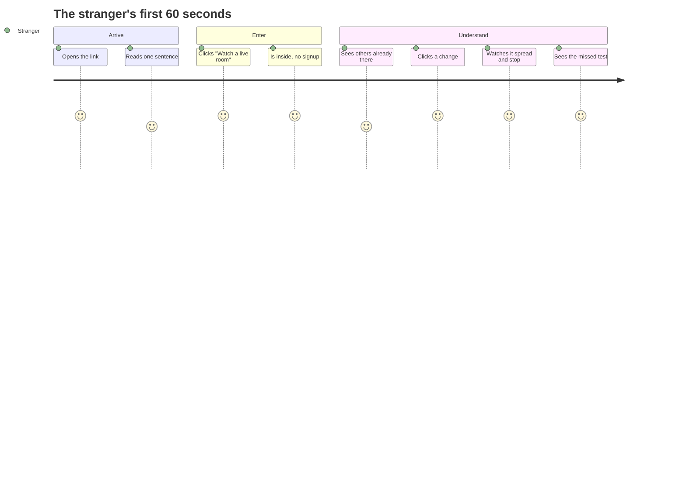

# Product PRD — The Map Room

*Plain language. No code, no schemas. What this is, who it's for, and what a person
actually does with it.*

---

## The one-liner

**Watch your AI agent explore your codebase, live — and when you see a place it
never looked, tap it, and the agent goes and looks.**

---

## Who it's for

**Primary:** engineering teams who let an AI agent decide what to verify. If you run
Claude Code, Cursor, Aider, or any autonomous agent against a repository, and that
agent chooses which tests to run, this is for you.

**Tonight's beachhead:** builders in this room. Every one of them is shipping
AI-written code they have not verified, on a repo that is four hours old.

**Not for:** people who want a better code-analysis tool. This does not make the map
better. It makes the map *visible*, and it refuses to pretend the map is good.

---

## Why anyone should care

When an AI agent works on your code, it doesn't read everything. That would be slow
and expensive. Instead it builds a **map of your code** — which function calls which
— and uses that map to decide what to look at and what to skip.

If the map is missing a road, the agent skips the test that would have caught the
bug. The bug ships. Nothing warns you, because from inside the tool everything
looked complete.

Somebody checked. Across **172 real bug fixes** in 7 well-known open-source
projects, the map found the test that catches the bug **42% of the time**. The
simpler map that most tools actually use: **31%**. On two of those projects: **zero
percent**.

That number has been in a table in a report. Nobody has ever *watched it happen*.



Nothing warns you about the red path. From inside the tool, the search *succeeded*.

---

## What the product does

**You open a link.** No account, no password, no email. The map of your codebase is
on screen — every file, every function — and it is **all dark**.

Dark means: nobody has looked here yet.

**Your agent starts working.** You give Claude Code a task. It reads files,
searches, edits. Every file it touches **lights up on the map, as it happens** — not
in a log afterwards. You watch its attention spread outward, like someone walking
through a dark building turning on lamps.

**Then you notice the light stops.** There is a whole region still dark. The agent
finished, said it was done, and never went there.

That is the part nobody has been able to see before. The agent didn't tell you what
it skipped — it couldn't. From inside, it looked finished.

**You tap the dark part.** That's the whole interaction.

**The agent goes and looks.** Your tap lands in the database. The agent picks it up,
spawns a helper pointed at exactly that region, and explores it — and you watch that
region light up too.

### And everyone sees it

Your teammate opens the same link on a laptop. Your lead opens it on a phone. They
see **everything you see, at the same instant** — the same spread, the same dark
patches. When you tap, it goes amber on their screen. When the agent finishes it,
green, on every screen at once.

Nobody refreshes. Nobody screenshares. You are all just in it, arguing about the
same dark corner while the agent works.

### Why the dark part is most of the map

An agent's context is finite, so it keeps only the top few hundred symbols from your
codebase. Measured against 172 real bug fixes, here is what survives that:

```
how much of the map the agent holds  →  how often it finds the test that catches the bug

full map    ████████████████████████████████████████  55%
top 400     ██▌                                        5%
top 200                                                0%
top 100                                                0%
top 50                                                 0%
```

The agent is not looking at your codebase. It is looking at a slice of it, chosen for
it, that nothing shows you. **The dark region is not an edge case — it is the
majority of your code, every single run.**

### What a search looks like

Each bar is one step outward from a change. This is a real search on a real bug:

```
step 1  █                                                    1 place
step 2  ████████████████                                    58 places
step 3  ████████████████████████████████████████████████   389 places
step 4  ███████████████                                     57 places
step 5  ███                                                 11 places
        ─────────────────────────────────────────────────
        nothing left to search · 416 places visited

        the test that catches this bug:  ✗ never reached
```

It spreads, peaks, narrows, and stops — and it stopped because **it ran out of
map**, not because it ran out of patience. The search was complete. The map was
wrong.

---

## Features



| | Feature | What the user gets |
|---|---|---|
| **F1** | **Join by link** | Open a URL and you're in. No signup, no password, no email. A name is optional. |
| **F2** | **See who's here** | Everyone in the room appears live — **including the AI agent**, which shows up as a participant like anyone else. |
| **F3** | **Watch the agent explore** | Every file it reads or edits lights up **as it happens**. Its attention, live, on a map. |
| **F4** | **See what it never touched** | The dark regions. This is the finding, and it is visible at a glance. |
| **F5** | **Tap a dark region** | One tap sends the agent there. It goes amber for everyone, then green when the agent has explored it. |
| **F6** | **Trace a change** | Pick a changed file and watch the search paint outward step by step, on everyone's screen at once. |
| **F7** | **See where a search stops** | The moment it runs out — and whether it ran out of *budget* or ran out of *map*. Those are very different, and the product says which. |
| **F8** | **See the test it missed** | The test that guards this bug, lit red, unreached. |
| **F9** | **Get the verdict** | A plain answer: *don't let the agent skip here — run everything.* With the number behind it. |
| **F10** | **Straight talk about the number** | Where a number can't honestly be computed, the product says so instead of inventing one. |
| **F11** | **Works on a phone** | The whole thing, on the device you actually have. |

---

## What a person does, start to finish



### The judge / the curious stranger — under 60 seconds

1. Opens the link. Lands on one sentence explaining what this is.
2. Clicks **Watch a live room**. No form, no wait.
3. Sees a real repository's map, and other people already in the room.
4. Clicks a change. Watches it spread and stop.
5. Reads the verdict and sees the missed test.

They now understand the problem, having *watched* it rather than been told.

### The builder with a team

1. Shares the room link with two teammates.
2. All three are in the same room, visibly.
3. One of them starts a search. **All three watch the same animation.**
4. They argue about the missed test, looking at the same screen.

The point of the room is that this is a conversation, not a report someone reads
alone.

---

## What it deliberately does not do

- **It doesn't fix your map.** The map it shows is deliberately the same kind of map
  the measurement indicts. Making a better one is a different product, and the
  evidence says a better one doesn't help much anyway.
- **It doesn't approve anything.** There is a path where it says "yes, the agent can
  skip here." It has never been reachable on real data, and it isn't faked open.
- **It doesn't guess.** On a repository with no known answer to check against, it
  says the number can't be computed here and shows what was measured elsewhere.

---

## How someone would find this

**Positioning:** the seatbelt for agent autonomy. Before an agent decides what not
to verify, something should ask whether it has earned that.

**First users:** the room, tonight. Everyone here is running an agent on a repo and
none of them can tell you what it isn't checking.

**After that:** the communities where people are already uneasy about this — Claude
Code and Cursor users, teams that turned on AI test selection and quietly turned it
back off.

---

## How we'd know it worked

- Someone who has never seen it finishes a search and explains the problem back,
  correctly, without help.
- Two people in the same room see the same animation at the same moment, and neither
  of them refreshes.
- Someone looks at the missed test and says *"wait, that's the one that matters."*

That third one is the whole product.
