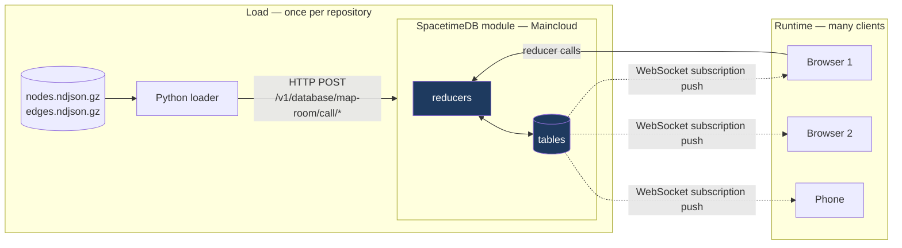

# Technical PRD — The Map Room

**Database:** `map-room` on SpacetimeDB Maincloud
**Module identity:** `c20088d16f3e198481c2676ada5219c531f1e967fc57281193f1716967b02015`

---

## System



There is **no application server**. The loader is a one-shot importer. The client
talks to the database directly.

---

## Schema

All tables `public: true`. Wire/SQL names are snake_case; generated TypeScript
bindings expose camelCase.

| Table | Columns |
|---|---|
| `repo` | `id` u64 pk autoInc · `slug` · `label` · `node_count` u32 · `edge_count` u32 · `reachability` f32 · `status` |
| `node` | `id` u64 pk · `repo_id` u64 · `kind` · `name` · `qual` |
| `edge` | `id` u64 pk autoInc · `repo_id` u64 · `src` u64 · `dst` u64 · `kind` |
| `participant` | `identity` pk · `name` · `repo_id` u64 · `focus_node` u64 · `online` bool |
| `walk` | `id` u64 pk autoInc · `repo_id` · `origin` · `k` u32 · `hop` u32 · `selected` u32 · `graph_complete` bool · `done` bool · `started_by` identity |
| `frontier` | `id` u64 pk autoInc · `walk_id` u64 · `hop` u32 · `node_id` u64 · `is_test` bool |
| `verdict` | `id` u64 pk autoInc · `walk_id` · `decision` · `recall_prior` f32 · `wilson_lb` f32 · `threshold` f32 · `reason` · `missed_test` u64 |

**Indexes (btree):** `repo.slug`, `node.repo_id`, `node.kind`, `edge.repo_id`,
`edge.src`, **`edge.dst`**, `participant.repo_id`, `walk.repo_id`,
`frontier.walk_id`, `verdict.walk_id`.

`edge.dst` is the one the backwards walk rides. Without it every hop is a full table
scan over 22,880 edges.

### v2 — the agent coverage tables

| Table | Columns |
|---|---|
| `node_cov` | `node_id` u64 pk · `repo_id` · `touches` u32 · `last_tool` · `last_session` · `explored` bool · `last_at` |
| `touch` | `id` u64 pk autoInc · `repo_id` · `node_id` · `path` · `tool` · `session` · `agent_name` · `at` |
| `agent_session` | `id` u64 pk autoInc · `session` · `agent_name` · `repo_id` · `online` bool · `touches` u32 · `started_at` · `last_at` |
| `exploration_request` | `id` u64 pk autoInc · `repo_id` · `node_id` · `path` · `note` · `status` · `asked_by` identity · `claimed_by` · `result` · `at` |

`exploration_request.status` ∈ `pending` | `claimed` | `done`.
Indexes: `node_cov.repo_id`, `touch.repo_id`, `exploration_request.repo_id`,
`exploration_request.status`, `agent_session.session`.

### v2 reducers

| Reducer | Signature |
|---|---|
| `report_touch` | `(repo_id: u64, session: string, agent_name: string, tool: string, paths_json: string)` |
| `request_exploration` | `(repo_id: u64, node_id: u64, note: string)` |
| `claim_request` | `(request_id: u64, agent_name: string)` |
| `complete_request` | `(request_id: u64, result: string)` |
| `agent_heartbeat` | `(session: string, agent_name: string, repo_id: u64)` |

### Path resolution — the load-bearing detail

`report_touch` receives repo-relative paths and must resolve them to node ids:

```
django/forms/fields.py
  strip extension     → django/forms/fields
  slashes to dots     → django.forms.fields
  match every node whose qual (before "::") ENDS WITH that
```

`endsWith` rather than equality, because shipped quals are prefixed
(`data.repos.django.forms.fields::...`). A file touch lights **every node in the
file**. Unresolved paths still write a `touch` row with `node_id = 0` so misses are
countable, never silently dropped.

**This runs on every agent tool use against up to 9,831 nodes**, so a naive
scan-with-`endsWith` per node per path is the hot spot to watch.

### Known schema defect

`node.id` is a **global** primary key, not scoped by `repo_id`. Loading the same
source graph into a second repo silently drops every node — ids collide — while
edges still land, because `edge.id` is `autoInc`. The result is a repo with
`node_count = 0` and phantom edges.

Worked around loader-side with `--id-offset N`. The correct fix is a compound
`(repo_id, id)` key. One repo in the live database is in this broken state and is
documented rather than hidden.

---

## Reducers

| Reducer | Signature | Notes |
|---|---|---|
| `create_repo` | `(slug: string, label: string)` | Idempotent by slug |
| `ingest_nodes` | `(repo_id: u64, rows_json: string)` | Idempotent — skips existing ids |
| `ingest_edges` | `(repo_id: u64, rows_json: string)` | **Not** idempotent — re-running doubles edges |
| `finish_repo` | `(repo_id: u64, reachability: f32)` | Recomputes exact counts |
| `join_room` | `(name: string, repo_id: u64)` | Upserts participant, `online = true` |
| `set_focus` | `(node_id: u64)` | Updates caller's `focus_node` |
| `start_walk` | `(repo_id: u64, origin: u64, k: u32)` | Inserts walk at hop 0, seeds frontier |
| `step_walk` | `(walk_id: u64)` | Expands **one** hop. No-op on a done walk |

Lifecycle: `identity_connected` / `identity_disconnected` flip `participant.online`.
Plus a no-op `init`.

`rows_json` is a JSON **string**, so over HTTP the positional array is
double-encoded:

```json
["1", "[{\"id\":1001,\"kind\":\"Test\",\"name\":\"...\",\"qual\":\"...\"}]"]
```

Passing a raw array fails with `trailing characters at line 1 column 9`.

---

## The walk

```
frontier(0) = { origin }
for hop in 1..=k:
    next = { e.src | e.dst ∈ frontier(hop-1) } \ visited
    if next is empty:
        graph_complete = true; done = true; emit verdict; stop
    write frontier rows for next, tagged with hop and is_test
    visited ∪= next
graph_complete = false; done = true; emit verdict
```

**Direction is the thing to get right.** Production code has no edge *to* the test
that guards it, so the walk runs along **predecessors** — collect `edge.src` where
`edge.dst` is in the current frontier. Measured on the corpus, the forward direction
(fix → test) connects **0 of 44** instances. A forward walk finds nothing, every
time.

`step_walk` expands exactly one hop per call so the client can drive the animation
and every subscriber sees each hop land separately. `walk.hop` is the last *painted*
hop — when a step discovers nothing, `hop` does not advance, `done` flips instead.

`walk.selected` is the cumulative count of **Test** nodes reached — the tests a
selector would run — not the total node count.

`graph_complete = true` whenever the frontier exhausts, including when it exhausts
exactly at `hop == k`. Exhaustion wins over the bound.

---

## The verdict

```
wilsonLb(hits, n, z = 1.645):
    if n == 0: return 0
    p      = hits / n
    denom  = 1 + z²/n
    centre = p + z²/(2n)
    margin = z · √((p(1-p) + z²/(4n)) / n)
    return (centre - margin) / denom
```

```
wilsonLb(72, 172) = 0.35845507   (stored f32: 0.35845506)
threshold         = 0.95
0.3585 < 0.95     → RUN_FULL
```

The bar is the **one-sided 95% lower bound**, never the point estimate — a perfect
3/3 gives 0.526 and still cannot license a skip. `SKIP_SAFE` is implemented and
reachable; no graph class has earned it.

`missed_test` is derived, not passed in: the first `Test` node in the repo the walk
never reached.

---

## Loader

```
python -m ingest.seed --instance <id> --module map-room [options]
  --arm {arm_a,arm_b,merged}   default: the arm with a usable origin
  --limit HOPS                 ship only the HOPS-hop backward closure of the origin
  --id-offset N                shift ids to avoid the global-PK collision
  --batch-size N               clamped to 1000
  --dry-run                    everything except the HTTP calls
  --list-instances             fix_site_ids survey
```

Reads gzip NDJSON, batches to ≤1000 rows per reducer call, POSTs to
`/v1/database/map-room/call/<reducer>`. Token from `$SPACETIME_TOKEN` or
`~/.config/spacetime/cli.toml`. `repo_id` is read back via
`POST /v1/database/map-room/sql`, because reducers return nothing.

**Throughput:** ~700 node rows/s, ~1,500–2,500 edge rows/s. A full instance
(9,831 nodes / 22,880 edges) loads in ~30 s across 35 reducer calls.

### Corpus notes

- Shipped `nodes/edges.ndjson.gz` are the **merged** payload for both arms in
  disjoint id bands (10e9 / 20e9). Merged django-10097 = 20,813 / 40,039; arm_b
  alone = 9,831 / 22,880.
- Every shipped node carries `label: "Function"`. There is **no `Test` label on
  disk**. Test identity is derived: leaf name starts with `test` **and** module path
  mentions `test`. That covers **612/612** of the labelled guarding tests on
  django-10097.
- 50 instances → **74 usable (instance, arm) pairs**. Four instances have no usable
  origin in either arm: `10914`, `10999`, `11141`, `11603`.

---

## Client

React 19 + Vite + Tailwind, on the SpacetimeDB TypeScript SDK. Bindings generated
into `client/src/module_bindings` (18 files).

```bash
spacetime generate --lang typescript --module-path ./module --out-dir ./client/src/module_bindings
```
`--module-path` is required; generate fails when run from inside `module/`.

**Animation contract:** call `step_walk(walkId)` on a 250–400 ms interval until
`walk.done === true`. Paint from **subscription rows**, never from local state —
otherwise a second tab that clicked nothing shows nothing, which is the single
failure that would invalidate the product.

**Coverage contract:** node lit/dark state comes from `node_cov`, subscription-driven.
Aggregate counts are computed client-side from subscribed rows, because SpacetimeDB
SQL has no `GROUP BY`.

---

## The Claude Code plugin

An installable plugin at `plugin/` that makes the agent a participant.

| Part | What it does |
|---|---|
| `Stop` hook | Fires when the agent finishes a turn; feeds pending requests back so it continues into the exploration with nobody typing. Closes the idle gap. |
| `PostToolUse` hook | Matches `Read\|Edit\|Write\|Grep\|Glob`; extracts paths from the tool input; POSTs to `report_touch`. **Fire-and-forget** — ~2s timeout, errors swallowed, never blocks a turn. |
| `UserPromptSubmit` hook | Queries pending `exploration_request` rows over `/sql` and injects them into context. Only when rows exist. |
| Skill | The protocol: claim a request, spawn a subagent scoped to that path, explore, `complete_request`. |

The agent cannot subscribe — it is turn-based. So human → agent is a **pull at turn
boundaries** via three hooks (`UserPromptSubmit` when you type, `Stop` when the agent
falls silent, and optionally a subscriber daemon for instant pickup); agent → human is
a true push.

## Repo indexing — `index_repo`

A **procedure** (not a reducer — procedures can make outbound HTTP calls):

```
index_repo(owner: string, repo: string, github_token: string)
  1. ctx.http.fetch(api.github.com/repos/{o}/{r}/git/trees/HEAD?recursive=1)
  2. filter to source extensions, skip vendor/node_modules/dist/.git
  3. ctx.withTx -> create_repo + one node per file
  4. qual = path minus extension, slashes -> dots   (MUST match report_touch's resolver)
  5. edges from directory containment, capped
  6. finish_repo
```

`truncated: true` on very large repos is recorded on the repo row and surfaced.
Each indexed repo gets its own node-id band, because `node.id` is a global primary key.

`summarize_region(node_id, api_key)` fetches file contents and asks Gemini for a
one-sentence description, stored on the node. Summaries only — never extraction.

---

## Constraints and gotchas

| Constraint | Consequence |
|---|---|
| Procedures cannot fetch while holding a transaction | fetch first, then `ctx.withTx` |
| `ctx.http.fetch` timeout: 30s default, 180s max | use the trees API, never a clone |
| SpacetimeDB SQL has no `GROUP BY`; aggregates need aliases | Query per-hop counts individually |
| Reducers return nothing | Read `repo_id` back over `/sql` |
| Browsers can't set `Authorization` on a WebSocket | Public tables, or a token via query param |
| `spacetime init` and the installer need a TTY | Installer takes `--yes`; the module scaffold was hand-written and diffed against the CLI templates |
| An origin with zero in-edges paints nothing | Originate only from labelled `fix_site_ids` |
| `spacetime publish -c` wipes all data | Never run it now that graphs are loaded |

---

## Verification

| Check | Result |
|---|---|
| `tsc --noEmit` | clean |
| `spacetime build` | clean |
| `spacetime publish map-room` | live |
| Wilson bound | `0.35845507` → f32 `0.35845506` |
| Walk direction | forward finds nothing; backward finds tests — matches 0/44 |
| Exhaustion path | walk 6: hops 1/58/389/57/11, `graph_complete = true` |
| Bound path | walk 5: 6 hops, `graph_complete = false` |
| Empty-origin path | walk 2: hop 0, `graph_complete = true`, empty — correct, and the demo hazard |
| Subset parity | 528-node subset walks bit-identically to 2,272-node graph |
| Loader | 4 repos live, counts verified back over `/sql` |
