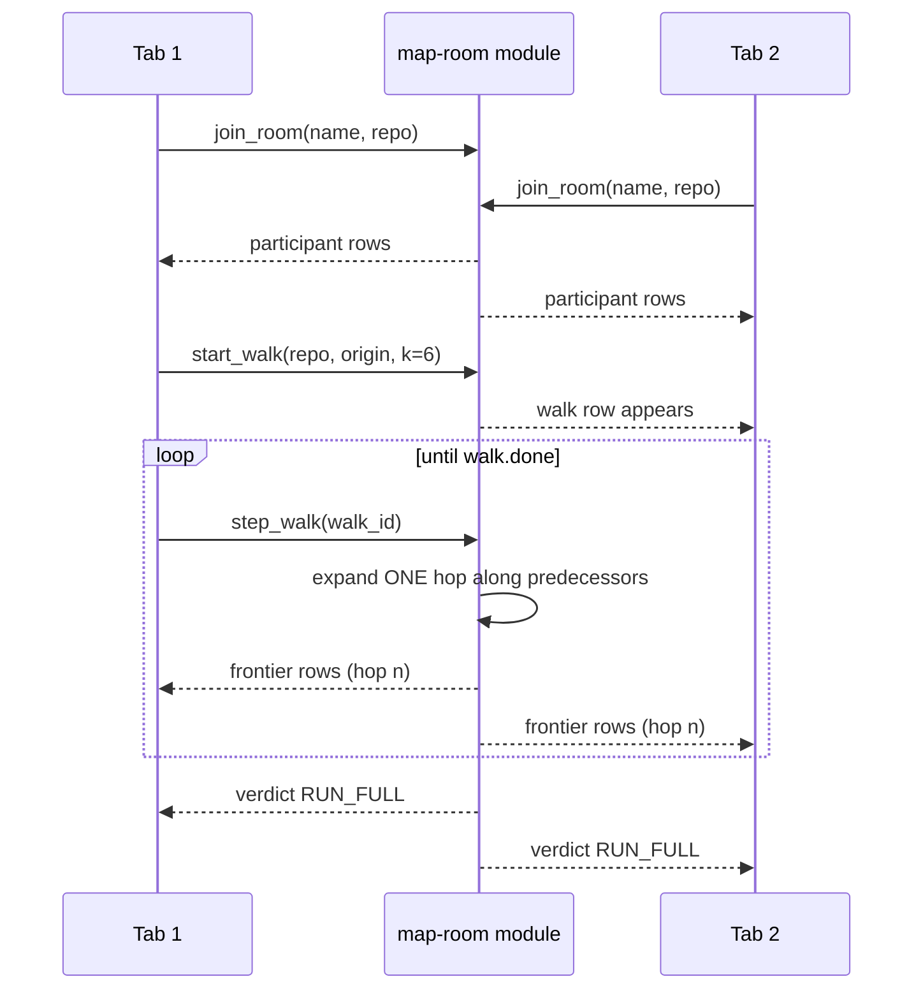

# The Map Room — PRD

**Status:** module live · loader live · client in build
**Database:** `map-room` on SpacetimeDB Maincloud

---

## One-liner

For engineers running AI coding agents — paste your repo and watch, with your team,
the map your agent is actually using, and the roads it can't see.

## ICP

Engineering teams who let an AI agent decide what to verify. Concretely: anyone
running Claude Code, Cursor, Aider, or an autonomous agent against a repository
where the agent selects which tests to run.

Tonight's beachhead is narrower and reachable: **builders in this room**, every one
of whom is shipping AI-written code they have not verified.

## The problem

An agent decides what to read and what to skip using a call graph. Measured across
172 human-verified bug fixes in 7 repositories, that graph reaches the test guarding
the fix **41.9%** of the time — **31.4%** for the name-matched graph most tools
actually build, and **0%** on matplotlib and pytest. Full detail:
[`PROBLEM.md`](PROBLEM.md).

Nobody has ever *watched* that miss happen.

---

## Scope

### In

| # | Requirement | Status |
|---|---|---|
| F1 | A room per repository, joinable by link, no password, no signup | built |
| F2 | Presence — everyone in the room is visible, live | built |
| F3 | Click a node → bounded k=6 **backwards** walk runs as a reducer | built |
| F4 | The walk emits one hop per `step_walk` call into a `frontier` table | built |
| F5 | Every subscribed client paints each hop as rows arrive, no refresh | client |
| F6 | On exhaustion or bound: verdict lands on every screen simultaneously | built |
| F7 | The guarding test the walk never reached is shown, lit red | built |
| F8 | Verdict is fail-closed on a Wilson lower bound, never a point estimate | built |
| F9 | Honest disclosure that recall is uncomputable on unlabelled code | built |
| F10 | Works on a phone | client |

### Out — cut deliberately

- Paste-your-own-repo ingest (needs live multi-language extraction)
- Room-wide leaderboard across repos
- Email capture
- Multi-language tree-sitter extraction
- Auth, accounts, persistence of user identity beyond a session

Cut for one reason: **the core loop beats every feature.** A leaderboard on top of
a walk that doesn't paint is worth nothing.

---

## The core loop



**Tab 2 never called anything and sees the identical animation.** That is the
product.

---

## Acceptance criteria

| # | Criterion | Verified |
|---|---|---|
| A1 | Two tabs, act in one, the other updates with no refresh | client pending |
| A2 | State in tables, logic in reducers, subscriptions drive the UI | yes |
| A3 | Walk direction is backwards; a forward walk finds nothing | yes — 0/44 forward |
| A4 | Verdict is reproducible: `wilsonLb(72,172) = 0.35845507` | yes, f32 `0.35845506` |
| A5 | Walk terminates correctly on exhaustion **and** on the k bound | yes — both observed |
| A6 | A subset graph gives a bit-identical answer to the full graph | yes — 528 vs 2,272 nodes |
| A7 | A first-time user completes the core task unaided in under 3 min | client pending |
| A8 | Opens and runs on a phone | client pending |

---

## The demo path — verified live

Repository `django__django-11292`, type-resolved graph, **2,272 nodes / 4,215 edges**.
Origin `20220000873`, a labelled fix site. Walk `k=6`:

```
hop 0 :   1 node    ← the fix site
hop 1 :  58 nodes
hop 2 : 389 nodes   ← the swell
hop 3 :  57 nodes
hop 4 :  11 nodes   ← the collapse
        ─────────
        416 nodes reached, frontier exhausted, graph_complete = true
```

The walk did not run out of hops. **It ran out of graph.** And it still never
reached:

```
DateTimeFieldTest#test_datetimefield_1()
  tests/forms_tests/field_tests/test_datetimefield.py
```

```
verdict     RUN_FULL
recall_prior  0.4186
wilson_lb     0.3585
threshold     0.95
```

A 528-node subset of the same origin walks **bit-identically** — same shape, same
exhaustion, same miss — and is the graph to render when speed matters.

---

## Success criteria (event rubric)

**Qualifiers**

| | Status |
|---|---|
| Opens and runs on a phone | client pending |
| Live URL opens on a judge's device | deploy pending |
| Module live on Maincloud, created in window | **done** — `map-room` |
| Repo created in window, nothing pushed after freeze | **done** |
| Demo video under 3 minutes | pending |
| One-liner: who it's for, what it does | **done** |
| Email comms live | **cut** — accepted risk |
| Stranger in under 30 seconds, no password | client pending |
| Onboarding exists | client pending |

**Parameters**

- *How real-time is it* — the walk cannot happen outside shared state; several
  people watch one graph change at once; state in tables, logic in reducers.
- *How well is the problem cracked* — the core task is finishing a walk and reading
  the verdict, unaided, in well under three minutes.
- *Can you take it to market* — ICP named above; the beachhead is the room.

---

## Risks

| Risk | Mitigation |
|---|---|
| An origin with no predecessors paints an empty screen | Only ever originate from labelled fix sites — 74 usable (instance, arm) pairs |
| A large graph renders slowly on a phone | Ship the 528-node subset; parity with the full graph is verified |
| `node.id` is a global PK — reloading collides | Loader `--id-offset`; documented |
| Client not finished at freeze | Module and loader are already live and demonstrable via SQL |

---

## Non-goals

This does not claim to be a better extractor. The graph it shows is deliberately the
same graph class the measurement indicts. The product is the **visibility and the
refusal**, not a fix for the map.
