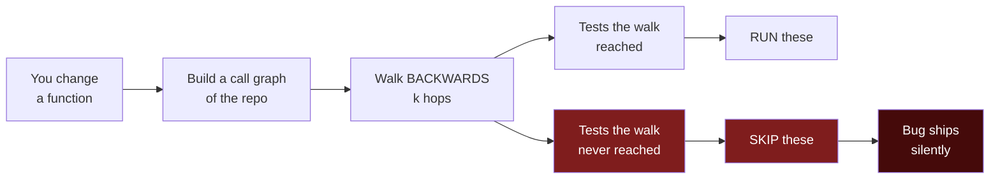
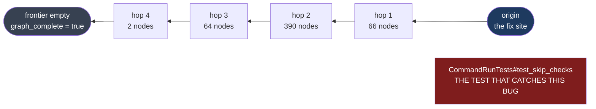
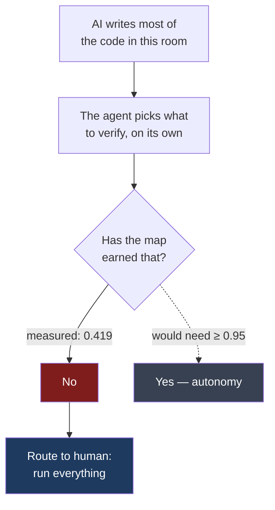

# Problem statement

## Statement

**An AI coding agent decides which tests to skip using a call graph that nobody has
validated. The graph reaches the test guarding a given fix 41.9% of the time. When
it misses, the agent skips the one test that would have caught the bug, and nothing
in the system reports a failure — the selection was complete with respect to the
graph, and the graph was wrong.**

## Context

Graph-based test selection is a good idea and it is spreading. Build a call graph,
walk backwards from the change, run the tests the walk reaches, skip the rest. It is
how Aider's repo map, RepoGraph and LocAgent reason about a repository, and it is
increasingly how autonomous agents decide what to verify before claiming a fix.

The appeal is obvious: test suites are expensive, most tests are irrelevant to most
changes, and a graph can tell you which.

## Who has the problem

Any team that lets an AI agent choose what to verify. The failure is silent by
construction, so the people affected do not know they have it — which is why the
problem persists.

## Why it is invisible from inside the tool

A backwards walk that exhausts its frontier before the hop bound is
**graph-complete**: no test reachable *in this graph* was cut off. That is a real
property, and a tool can check it and report success.

It is also silent about the edges the graph never had. **An extractor cannot
fail-closed on an edge it does not know exists.** Graph-completeness cannot detect
a missing edge. Only a recall measurement against known labels can.

## Why it is not self-correcting

- Measured across eight years of django history, the figure is flat. It is not
  improving on its own.
- Upgrading from name matching to full type resolution moves paired recall by
  **+0.071**, and the discordant split is indistinguishable from chance
  (McNemar p = 0.73). Better extraction buys precision, and precision is not what
  makes a skip safe.
- On matplotlib and pytest the type-resolved graph scores **zero**. Those guarding
  tests are not far away; they are in a different component entirely.

## Scope of the claim

This measures whether a labelled test can reach the fix it guards, transitively,
within a bounded number of hops — a property of a specific *pair*, not of a single
edge. It is a harder relation than the edge-level recall reported by PyCG (~70% on
Python) or Sui et al. (median 0.884 on Java). The numbers are not comparable, and no
claim is made that this extractor is worse than theirs.

## What is missing

The measurement exists. What has never existed is any way to **watch the miss
happen** — to see a walk crawl outward, exhaust, and stop short of the one test that
mattered, with your team watching the same thing at the same moment.

---

## How an agent picks what to verify

Every graph-based test selector does the same three things. Build a call graph,
walk backwards from the change, run the tests the walk reaches, skip the rest.



The walk runs along **predecessors**, and that direction is easy to get backwards:
production code has no edge *to* the test that guards it. Measured on this corpus,
the forward direction (fix → test) connects **0 of 44** instances.

The step nobody checks is the arrow from `E` to `G`. The walk can be provably
complete *with respect to the graph* while the graph is missing the edge that
mattered *in the program*. An extractor cannot fail-closed on an edge it never
knew existed.

---

## What that looks like on a real bug

`django__django-11292`. The fix lands in one function. The walk runs backwards from
it, six hops allowed. It exhausts after four.



The walk visited **522 nodes across 4 hops** and terminated cleanly. It reached
**0 of 1** labelled guarding tests. The test that catches this exact bug is not
beyond the hop bound — it is simply **not connected** in this graph.

`graph_complete = true` and *the right test was still missed*. That is the whole
problem in one line.

---

## The measurement

172 real, human-verified bug fixes across 7 repositories. The label is not ours:
SWE-bench's `FAIL_TO_PASS` test **is** the test that guards the fix.

| Graph class | What it is | Recall |
|---|---|---|
| **arm A — name-matched** | `x.foo()` links to *every* function named `foo`. What Aider's repo map, RepoGraph and LocAgent actually build. | **0.314** (37/118) |
| **arm B — type-resolved** | Indexed with `scip-python` (pyright-backed): `x.foo()` resolves on the real static type, or to nothing. | **0.419** (72/172) |

Pooled arm B 95% Wilson interval: **0.347 – 0.493**.

### Per repository — the spread is the finding

```
                arm A            arm B
django       15/30  ██████▌      24/44  ███████
matplotlib    2/18  █▌            0/33
pytest        6/16  ████▊         0/19
requests      3/6   ██████▌       8/8   ████████████▌
sphinx        9/33  ███▍         18/44  █████▏
sympy         0/1                 3/3   ████████████▌
xarray        2/14  █▊           19/21  ███████████▎
─────────────────────────────────────────────────
pooled       37/118 ███▉         72/172 █████▎
                    0.314               0.419
                                        bar for a skip: 0.95
```

**matplotlib and pytest sit at zero on the type-resolved arm.** Their guarding
tests are not merely beyond `k` hops — they are in a *different component of the
graph*. Endpoints present, mapped, and disconnected. Dynamic dispatch machinery
(`pyplot`, pytest's plugin hooks) is invisible to both extractors.

---

## "Just use a better extractor" is not a fix

Arm A and arm B index the same commits. Moving from name matching to full pyright
type resolution is a large **precision** gain. Measured on the 28 instances where
both arms are answerable:

| | Value |
|---|---|
| arm A recall | 0.536 |
| arm B recall | 0.607 |
| delta | **+0.071** |
| both found it | 12 |
| arm A only | 3 |
| arm B only | 5 |
| neither | 8 |
| exact McNemar | **p = 0.7266** |

The full type-resolution upgrade moves paired recall by 0.071, and the discordant
split is indistinguishable from chance. Type resolution buys precision, and
**precision is not what makes a skip safe.**

---

## Why this matters tonight



The bar for granting autonomy is the **one-sided 95% Wilson lower bound**, never
the point estimate — so a lucky small sample can never license a skip.

`wilsonLb(72, 172) = 0.3585`. The bar is `0.95`.

**0.3585 < 0.95 → RUN_FULL.** Every time, today. That refusal is the product
working, not the product failing.

---

## What has never existed

The number above is a number in a table. Nobody has ever *watched* the miss
happen — watched a walk crawl outward, exhaust, and stop short of the one test
that mattered, with their team watching the same thing at the same moment.

That is what The Map Room is. See [`SOLUTION.md`](SOLUTION.md).
