# Process

How this got built, what was cut, and what the build found out that changed the
design. Written as it happened, including the parts that went wrong.

---

## Constraints

Solo builder. No SpacetimeDB CLI installed at the start. A hard deadline. That
budget only pays for **one vertical slice**, so every decision below was made by
asking which option protects the core loop.

```mermaid
gantt
    dateFormat HH:mm
    axisFormat %H:%M
    title Build
    section Setup
    CLI install + login        :done, 00:00, 25m
    section Design
    Scope and schema contract  :done, 00:25, 35m
    section Build
    Module (tables + walk)     :done, 01:00, 90m
    Loader (corpus to live)    :done, 01:00, 120m
    Client (room + paint)      :active, 01:00, 150m
    section Ship
    Docs + verification        :01:30, 60m
```

---

## The scope cut

Everything below the line was cut, on purpose, before any code was written.

**Kept — the vertical slice:**
- The module: tables, the backwards walk reducer, presence, the verdict
- One seeded graph, real, from a labelled corpus
- A client where two tabs watch the same walk paint

**Cut:**
- Paste-your-own-repo ingest (needs a live multi-language extractor)
- The room-wide leaderboard
- Email capture
- Multi-language tree-sitter extraction
- Any second graph class beyond what ships in the corpus

The rule applied throughout: **the core loop beats every feature.** A leaderboard
attached to a walk that doesn't paint is worth nothing.

---

## Decisions, in the order they were forced

### 1. Where does the real-time actually live?

The honest failure mode for this project is bolting a live dashboard onto a batch
tool and calling it multiplayer. The decision that avoided it: **the walk itself
becomes a reducer that emits its frontier hop by hop.**

Not "run the walk, then broadcast the result" — run *one hop per call*, write the
discovered nodes into a `frontier` table, and let subscriptions push each hop.
A client that clicked nothing sees the identical animation because it is reading
the same rows.

### 2. Which language for the module?

SpacetimeDB modules run in Rust, C#, TypeScript or C++. Rust unlocks
**procedures** (`ctx.http.send`) — the module could fetch a repo itself with no
backend anywhere, which is the strongest possible architecture. TypeScript (V8)
does not support procedures.

Chose **TypeScript**: with a loader doing the fetch, procedures were moot, and one
language across module and client beat a second unfamiliar one under a deadline.

### 3. The metric — and the finding that killed the first choice

The plan was to rank repos by **test→code reachability at k=6**: what fraction of
test nodes can reach any source function within six backward hops. Label-free, so
it works on an unlabelled repo.

**It saturates.** Measured across instances: 0.9998, 1.0, 0.9997, 0.9996. At six
hops essentially every test reaches *some* code. The number is real and it is
useless — it cannot rank anything.

What replaced it is sharper and honest: **how many tests the walk from *this*
origin actually reaches.**

| instance | tests reached / total |
|---|---|
| django-10097 | 14 / 12,755 — **0.0011** |
| django-11292 | 416 / 1,593 — **0.2611** |

That is the "roads it can't see" number. The saturated metric is documented here
rather than quietly dropped, because a metric that fails is worth more written down
than deleted.

### 4. The verdict must be able to refuse

`SKIP_SAFE` is gated on the **one-sided 95% Wilson lower bound**, not the point
estimate. `wilsonLb(72, 172) = 0.3585` against a `0.95` bar → `RUN_FULL`, today and
every day. A perfect 3/3 scores `0.526` and still cannot license a skip.

The path to `SKIP_SAFE` is implemented and reachable. It unlocks the day a graph
class earns it. None has.

---

## Things that broke

### `node.id` is a global primary key

Seeding the same source graph into a second room silently dropped **every node** —
`repo_id` does not scope node identity, so all ids collided with the first load.
Edges still landed (their ids are `autoInc`), producing a room with `node_count = 0`
and `edge_count = 568`: a graph of pure phantom edges.

Fixed loader-side with `--id-offset N`. The leftover broken room is still in the
database — there is no delete reducer — and is documented rather than hidden.

### An origin with no predecessors paints nothing

A walk from a node with **zero in-edges** finishes at hop 0 with
`graph_complete = true` and an empty screen. The module is correct: the predecessor
set really is empty. But it is the demo-killer.

The fix is choosing the origin from the corpus's labelled `fix_site_ids`, never an
arbitrary node. Of 50 instances, **74 (instance, arm) pairs have a usable origin**;
four instances have none in either arm and are excluded.

### The `Test` label isn't in the data

Every shipped node carries `label: "Function"` — there is no `Test` label on disk.
Test identity is derived instead: leaf name starts with `test` **and** the module
path mentions `test`. Checked against the corpus's own labels, that heuristic
covers **612 / 612** of the labelled guarding tests on django-10097.

Derived, disclosed, and measured — not assumed.

### `spacetime init` needs a TTY

It hangs on a prompt even under `script -q /dev/null`. The module scaffold was
hand-written instead, then diffed against the real CLI templates pulled from the
SpacetimeDB source. Identical on every `compilerOptions` field, including all five
marked as required. `spacetime build` and `spacetime publish` both succeed, which
is the proof that matters.

The CLI installer has the same TTY problem — `--yes` gets past it.

---

## Verification

| Check | Result |
|---|---|
| module typechecks | `tsc --noEmit` clean |
| module builds | `spacetime build` clean |
| module published | `map-room` live on Maincloud |
| walk direction | forward walk finds nothing; backward walk finds the tests — matches the measured 0/44 forward connectivity |
| Wilson bound | `wilsonLb(72,172) = 0.35845507`, stored f32 `0.35845506` |
| walk on real data | 376 → 51 → 1 nodes, exhausted hop 3, `graph_complete = true`, `RUN_FULL` |
| subset parity | 528-node subset walks **bit-identically** to the full 2,272-node graph |
| loader throughput | ~700 node rows/s, ~2,000 edge rows/s; full instance in ~30 s |

---

## What a second day would buy

1. Paste-your-own-repo, with name-matched extraction across TypeScript, Rust,
   C# and Python. The extraction is deliberately crude — it is the same graph
   class the measurement indicts, which is the point.
2. The room-wide leaderboard, ranked on the sharp per-origin number rather than
   the saturated one.
3. Scoping `node.id` by `repo_id` in the module so the loader doesn't have to
   hand-manage id bands.
4. A `drop_repo` reducer, so a bad load is recoverable without wiping the database.
