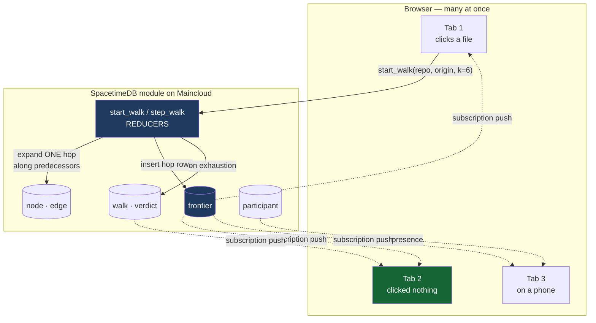

# The solution

**The Map Room** — paste your repo and watch, with your team, the map your AI agent
is actually using, and the roads it can't see.

---

## The idea

Put the AI agent and the human **in the same room, looking at the same map.**

The agent publishes what it explores as it works. The map lights up live. What stays
dark is what the agent never looked at — and because a human can see it, a human can
point at it, and that point reaches the agent.

Two things had to move into the database for that to work:

1. **The graph and the walk** — so a search is an event several people watch happen,
   not a function that returns a set.
2. **The agent's attention** — so exploration is shared state rather than a log
   nobody reads.



**Tab 2 clicked nothing and sees the identical animation.** That is not a feature
bolted on top — it is the only reason the walk is in a database at all.

---

## The agent loop — the core of the product

1. The agent works. A `PostToolUse` hook reports every file it reads or edits to
   `report_touch`, which resolves the path to graph nodes and marks them explored.
2. Every connected screen lights those nodes **as it happens**. The rest stays dark.
3. A human taps a dark region → `request_exploration` writes a row. It goes amber on
   every screen at once.
4. The agent's `UserPromptSubmit` hook picks up pending requests and injects them
   into context. It claims one, spawns a subagent scoped to that region, explores.
5. That exploration fires the coverage hook again — **the region lights up**, and the
   request goes green for everyone.

Full detail in [`AGENT-LOOP.md`](AGENT-LOOP.md).

## The walk loop

1. Open a room. Anyone with the link is inside it, no password, no signup.
2. Click a changed file. The client calls `start_walk(repo_id, origin, k=6)`.
3. The client drives the animation by calling `step_walk(walk_id)` on an interval.
   Each call expands **exactly one hop** and writes that hop's discovered nodes
   into the `frontier` table.
4. Every subscribed client paints the new hop as the rows arrive. Nobody refreshes.
5. The frontier exhausts, or hits `k`. `walk.done` flips, `graph_complete` is set,
   and the `verdict` row lands on every screen simultaneously.
6. The guarding test the walk never reached lights up red — for everyone.

---

## Why the module is doing the real work

| Concern | Where it lives |
|---|---|
| the graph | `node` / `edge` tables — 2,272 nodes, 4,215 edges for the demo repo |
| the walk | `step_walk` reducer — bounded BFS along **predecessors** |
| what's been painted | `frontier` table, one row per node per hop |
| exhaustion / bound | `walk.graph_complete`, `walk.done` |
| the decision | `verdict` reducer logic — Wilson lower bound vs threshold |
| who's here | `participant` + `identity_connected` / `identity_disconnected` |
| what the agent explored | `node_cov` / `touch` — written by the agent's hook |
| the agent itself | `agent_session` — it appears in the room as a participant |
| a human's correction | `exploration_request`, `pending → claimed → done` |

There is no application server. The client subscribes and calls reducers; the
Python loader is an importer that runs once per repo.

---

## Schema

```
repo        id · slug · label · node_count · edge_count · reachability · status
node        id · repo_id · kind · name · qual
edge        id · repo_id · src · dst · kind
participant identity · name · repo_id · focus_node · online
walk        id · repo_id · origin · k · hop · selected · graph_complete · done · started_by
frontier    id · walk_id · hop · node_id · is_test
verdict     id · walk_id · decision · recall_prior · wilson_lb · threshold · reason · missed_test
```

Reducers: `create_repo` · `ingest_nodes` · `ingest_edges` · `finish_repo` ·
`join_room` · `set_focus` · `start_walk` · `step_walk`, plus the two lifecycle
reducers.

Indexed on `edge.dst` — the column the backwards walk rides — so no hop does a
full table scan.

---

## The verdict is fail-closed

```
wilsonLb(hits = 72, n = 172, z = 1.645) = 0.3585
threshold                               = 0.95
0.3585 < 0.95                           → RUN_FULL
```

The bar is the **one-sided 95% Wilson lower bound**, never the point estimate. A
perfect 3/3 gives `0.526` and still cannot license a skip. The `SKIP_SAFE` path
exists and is reachable — it unlocks the day a graph class earns it. None has yet.

### What it refuses to fake

Recall needs a labelled guarding test to check against. **An unlabelled repository
has none**, so recall is not computable there. Where the product shows a verdict on
code with no labels, it says so and cites the measured prior instead of inventing a
number.

---

## Verified on the demo repo

`django__django-11292`, type-resolved arm, loaded live on Maincloud:

| | |
|---|---|
| graph | 2,272 nodes · 4,215 edges |
| walk from origin | hop 1: **66** · hop 2: **390** · hop 3: **64** · hop 4: **2** |
| terminated | frontier exhausted at hop 4, `graph_complete = true` |
| guarding tests reached | **0 of 1** |
| missed | `CommandRunTests#test_skip_checks` |
| verdict | `RUN_FULL` · `wilson_lb 0.3585` · `threshold 0.95` |

A 6-hop backward closure of the same origin is **528 nodes / 568 edges** and the
walk is *bit-identical* — same frontier sizes, same exhaustion, same miss. That
subset is what renders in the room when speed matters, and it changes nothing about
the answer.

---

## Stack

- **Module** — TypeScript on SpacetimeDB Maincloud, database `map-room`
- **Client** — React 19 + Vite + Tailwind on the SpacetimeDB TS SDK
- **Loader** — Python: gzip NDJSON → batched reducer calls over the HTTP API
  (~700 node rows/s, ~2,000 edge rows/s; a full instance loads in ~30 s)
- **Corpus** — SWE-bench Verified, 50 django instances shipped
