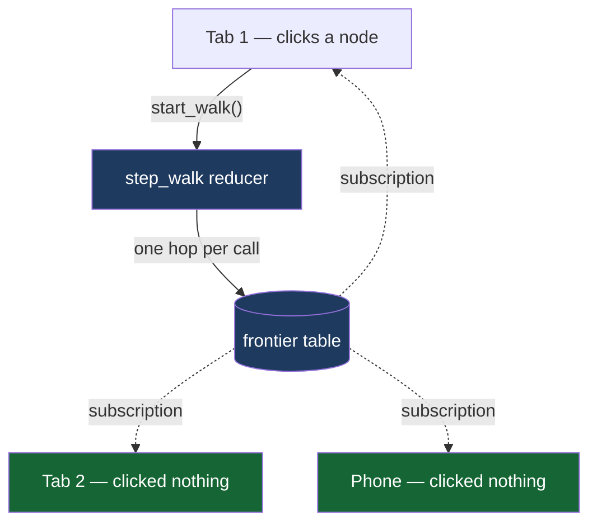

# Where and how we use SpacetimeDB

The short answer: **the product is the database.** There is no application server,
no API layer, no WebSocket plumbing, and no separate cache. The graph is tables, the
algorithm is a reducer, and the UI is a subscription.

---

## The test that matters

Open two tabs. Click in one. Watch the other.

Nothing in tab 2 polls, refetches, or refreshes. Tab 2 never called a reducer. It is
subscribed to `frontier`, and the rows arrive as the walk in the module produces
them. The animation in tab 2 *is* the database changing.



---

## 1. State lives in tables

The call graph is not a file we generate and serve. It is **rows**.

```
node   id · repo_id · kind · name · qual
edge   id · repo_id · src · dst · kind
```

`django__django-11292` is 2,272 node rows and 4,215 edge rows, resident in the
database. `django__django-10097` is 9,831 and 22,880. Anyone can subscribe to a
slice of them.

Because it's a real table, `edge.dst` carries a **btree index** — the column the
backwards walk rides. Without it, every hop is a full scan over 22,880 rows. This is
the part that would otherwise have been a graph database plus a cache plus an
invalidation strategy.

## 2. Logic lives in reducers

The walk is not a function in a Python process that returns a set. It is
`step_walk`, a reducer, executing **inside the database, in a transaction**:

```
next = { e.src | e.dst ∈ current_frontier } \ visited
```

One hop per call. Each hop writes its discovered nodes into `frontier` tagged with
the hop number. The verdict — the Wilson lower bound against the 0.95 bar — is
computed in the module and written to `verdict`.

Nothing about the decision happens client-side. A client that lied about the result
would be contradicted by the row everyone else can read.

## 3. Subscriptions drive the UI

The client renders from its local cache of subscribed rows. It does not fetch. When
`step_walk` inserts hop 3's nodes, every connected client's `frontier` cache gains
those rows and the UI repaints.

The verdict lands the same way — one row insert, N screens.

## 4. Presence is native

```
participant   identity · name · repo_id · focus_node · online
```

`identity_connected` and `identity_disconnected` are **lifecycle reducers** the
database calls for us. Who's in the room, and who just left, required no heartbeat,
no timeout sweeper, and no presence service.

`ctx.sender` gives the caller's identity inside every reducer, so `set_focus` knows
whose focus to update without the client asserting who it is.

## 5. Loading over the HTTP API

The Python loader never opens a socket or learns a wire format. It POSTs:

```
POST /v1/database/map-room/call/ingest_nodes
Authorization: Bearer <token from ~/.config/spacetime/cli.toml>
["1", "[{\"id\":...,\"kind\":\"Function\",...}]"]
```

Batches of ≤1000 rows, ~700 node rows/s and ~2,000 edge rows/s. A full instance
loads in ~30 s across 35 calls.

It reads state back the same way, because reducers return nothing:

```
POST /v1/database/map-room/sql
SELECT id FROM repo WHERE slug = 'django__django-11292'
```

## 6. Introspection without bindings

Any client can read a module's shape at runtime:

```
GET /v1/database/map-room/schema     → every table and reducer signature
```

And subscribe over a raw socket with no generated code at all:

```js
new WebSocket(url, 'v1.json.spacetimedb')   // text SATS-JSON protocol
```

We use the generated TypeScript bindings for the app, but the zero-bindings path is
what makes a universal inspector possible at all.

---

## Features used, concretely

| SpacetimeDB feature | Used for |
|---|---|
| Tables as primary state | the call graph, walks, frontier, verdicts, presence |
| Reducers | the bounded backwards BFS; the verdict; ingest |
| Transactions | one hop = one atomic state change every client sees identically |
| btree indexes | `edge.dst` for the walk; `frontier.walk_id` for the paint |
| Subscriptions | the entire UI — no polling anywhere |
| `identity_connected` / `identity_disconnected` | presence, for free |
| `ctx.sender` | attributing focus and walk ownership without client claims |
| `autoInc` primary keys | walk / frontier / verdict / edge ids |
| HTTP `call/<reducer>` | the bulk loader |
| HTTP `/sql` | reading ids back |
| Maincloud | hosting; nothing else is deployed server-side |

---

## What we did **not** have to build

This is the honest measure of what the database bought:

- a WebSocket server, and a reconnect/resume story
- a pub/sub layer and a fan-out strategy
- a presence service with heartbeats and timeouts
- a REST API in front of the graph
- a cache, and its invalidation
- a job queue to run the walk asynchronously
- a way to push each hop to N clients in order
- any deployed backend at all

The module *is* all of that.

---

## Why this product can't exist without it

Not "would be harder without" — **cannot exist**.

The product is several people watching one graph being traversed at the same
moment. The unit of value is the *shared* observation: you and your teammate seeing
the frontier stop short of the same test, at the same time, and arguing about it.

A single-player version of this is a static picture. It's already been published as
a number in a table, and nobody looked. The thing that makes it land is watching it
happen, together — and that is exactly and only what live shared state provides.

The walk is also genuinely *in* the database rather than in front of it. The
frontier isn't a broadcast of a result computed elsewhere; it's the intermediate
state of an algorithm running in transactions, which is why every client sees the
same hops in the same order.

---

## Verify it yourself

```bash
spacetime sql map-room "SELECT id, slug, node_count, edge_count FROM repo"
spacetime sql map-room "SELECT id, hop, selected, graph_complete, done FROM walk"
spacetime sql map-room "SELECT COUNT(*) AS n FROM frontier WHERE walk_id = 6 AND hop = 2"
spacetime sql map-room "SELECT decision, wilson_lb, threshold, missed_test FROM verdict"
```

Live results at time of writing:

```
walk 6, origin 20220000873, k=6
  hop 0:   1    hop 2: 389    hop 4:  11
  hop 1:  58    hop 3:  57    → 416 nodes, frontier exhausted

  graph_complete = true      ← ran out of graph, not out of hops
  verdict        = RUN_FULL
  wilson_lb      = 0.35845506   threshold 0.95
  missed_test    = DateTimeFieldTest#test_datetimefield_1()
```
